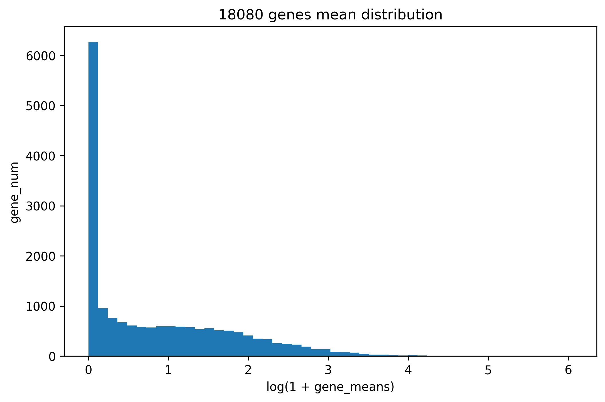
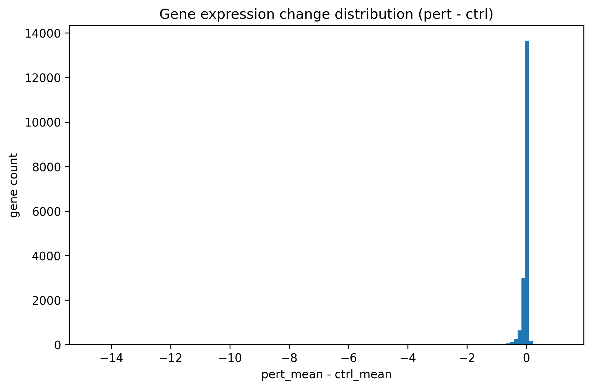
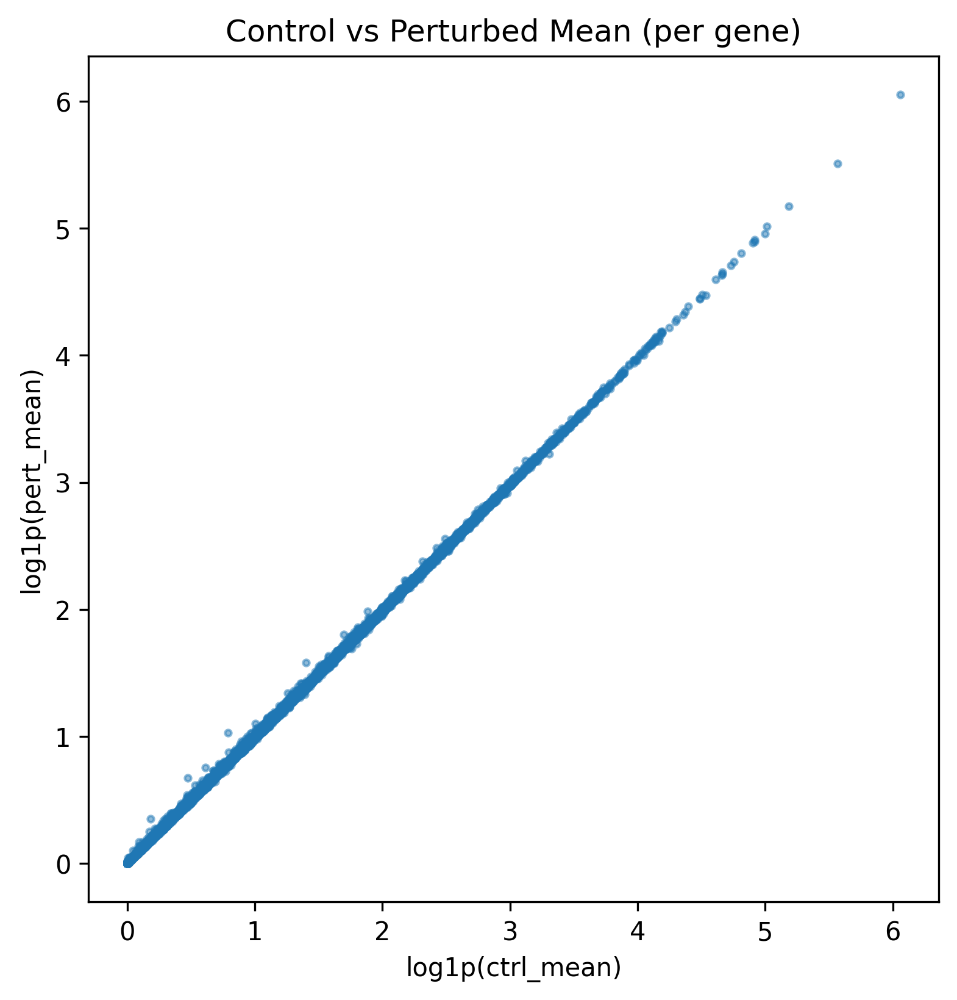
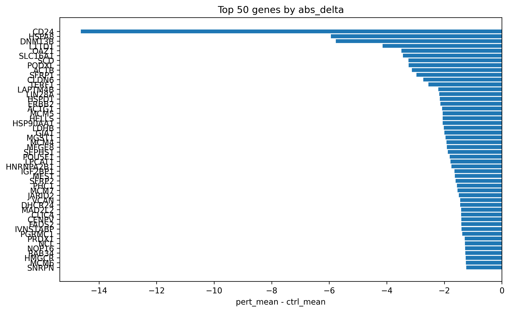

# VCC Training Data Statistics

文件夹 (`statistics/`) 包含对 VCC 训练数据 (`adata_Training.h5ad`) 的初步数据分析

## 📁 目录结构
```
statistics/
│
├── training_data_statistics.py # 全体数据统计
├── gene_delta_statistics.py # Control vs Perturbation 差异分析
│
├── gene_statistics.csv # 所有基因基础统计
├── gene_delta_all_sorted.csv # 所有基因按 abs_delta 排序
├── gene_delta_top50.csv # 变化最大的前 50 个基因
├── gene_delta_with_nonzero_fraction.csv # 多一列：基因在 control 中的表达比例
│
└── plots/
├── gene_mean_distribution.png
├── control_gene_mean_distribution.png
├── gene_delta_distribution.png
├── ctrl_vs_pert_scatter.png
├── top50_delta_barh.png
```

---

## 📌 1️⃣ `training_data_statistics.py`

### 🔍 功能
对全体 **221,273 个细胞 × 18,080 个基因**做统计，包括：

- 每个基因的平均表达 / 最大值 / 最小值  
- 每个基因在多少细胞中有非零表达  
- 总体基因表达分布图    

### 📈 输出示例
```
终端输出：
读取数据：../STATE/vcc_data/adata_Training.h5ad
AnnData object with n_obs × n_vars = 221273 × 18080
obs: target_gene, guide_id, batch
var: gene_id

平均表达值均值： 3.1473236
平均最大表达值： 32.037113
平均最小值表达值： 0.007522124
基因完全不表达的比例： 0.0002212389
```

### 🧪 生成的 CSV
`gene_statistics.csv`（前几行示例）：
| gene     | mean | max  | min  | nonzero_fraction |
|----------|------|------|------|-----------------|
| SAMD11   |  |  |   |             |
| NOC2L    |  |  |   |             |
| ...      | ...  | ...  | ...  | ...             |

### 📊 输出图示 (plots/)
- **18080 基因平均表达分布** 
 
  说明：大多数基因表达低，少数高表达（符合 scRNA-seq 偏态分布）

---

## 📌 2️⃣ `gene_delta_statistics.py`

### 📈 数据概况
- 总细胞: 221,273  
- control: 38,176  
- perturbed: 183,097  
- Control 中永不表达的基因数量：239  

### 🧪 生成的 CSV
`gene_delta_all_sorted.csv`（按 `abs_delta` 从大到小排序）：
| gene   | ctrl_mean | pert_mean | delta  | abs_delta |
|--------|-----------|-----------|--------|-----------|
| CD24   |      |       |   |       |
| HSPA8  |       |       |   |       |
| ...    | ...       | ...       | ...    | ...       |

- `gene_delta_top50.csv`：Top-K 差异基因，直接用于分析或模型 debug  
- `gene_delta_with_nonzero_fraction.csv`：附加 control 非零表达比例，有助于标记永不表达基因  

### 📊 输出图示 (plots/)
- **基因表达变化分布（delta = pert_mean - ctrl_mean）**  

  说明：扰动信号极稀疏 → 大部分基因变化 ≈ 0，少量显著变化  

- **Control vs Perturbed 散点图（log scale）**  

  说明：点集中在对角线 → 大多数基因不受扰动影响  

- **Top 50 差异基因条形图**  

  说明：模型应该重点学习这些 gene

---

## 📎 脚本使用方法

**全基因统计：**
```bash
cd statistics
python training_data_statistics.py -i ../STATE/vcc_data/adata_Training.h5ad
