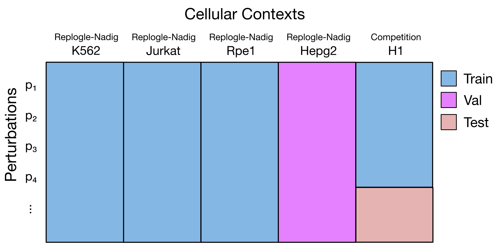

# 本周进展
1. 跑通STATE训练和测试流程
2. 阅读STATE论文

# 训练
## 📁 数据与配置
使用的数据与配置文件如下：

| 项目 | 文件路径 | 说明 |
|------|-----------|------|
| 训练数据 | `competition_support_set/competition_train.h5ad` | 训练集（含 control + perturbation） |
| 配置文件 | `competition_support_set/starter.toml` | 指定训练数据读取方式与列名映射 |
| 扰动特征 | `competition_support_set/ESM2_pert_features.pt` | 基因扰动的 ESM2 embedding 特征 |
| 输出目录 | `./checkpoints/first_run` | 保存模型权重与日志 |


---

## ⚙️ 训练命令

```bash
state tx train \
  data.kwargs.toml_config_path="competition_support_set/starter.toml" \
  data.kwargs.num_workers=8 \
  data.kwargs.batch_col="batch_var" \
  data.kwargs.pert_col="target_gene" \
  data.kwargs.cell_type_key="cell_type" \
  data.kwargs.control_pert="non-targeting" \
  data.kwargs.perturbation_features_file="competition_support_set/ESM2_pert_features.pt" \
  training.max_steps=40000 \
  training.ckpt_every_n_steps=20000 \
  model=state_sm \
  wandb.tags="[first_run]" \
  wandb.project=vcc \
  wandb.entity=arcinstitute \
  output_dir="./checkpoints" \
  name="first_run"
```

# 🧬 STATE 模型结构汇报总结
> (2025). *Single-cell Transformer for Adaptive Transcriptomic Effects (STATE)*  
> 论文章节：Methods §4.3 (ST) & §4.4 (SE)

---

## 🌐 总体结构概览

STATE 模型分为两个主要模块：

| 模块 | 名称 | 作用 | 训练方式 |
|------|------|------|-----------|
| 🧠 **SE (State Embedding)** | 学习单细胞的表示 | 自监督训练（self-supervised） | 生成 cell embedding |
| 🔁 **ST (State Transition)** | 学习扰动如何改变细胞状态 | 有监督训练（supervised） | 实现 control → perturbed 转换 |

---

## 🧩 SE 模块（State Embedding, §4.4）

SE 模型用于学习每个细胞的高维 embedding。其核心思路是：
> 利用蛋白语言模型（ESM2）将每个基因转化为语义向量，再通过 Transformer 建模基因间关系，从而获得细胞级别的表征。

### 🔬 结构步骤与论文对应

| 步骤 | 论文出处 | 说明 | 输出维度 |
|------|-----------|------|-----------|
| 1️⃣ **基因层 embedding** | Eq. (23) | 用 **ESM2** 生成每个基因 5120 维 embedding，经线性层压缩至 `h=672` | 每个基因 → 672维 |
| 2️⃣ **细胞层序列** | Eq. (24) | 每个细胞选取 **前 2048 个高表达基因**，加上 `[CLS]` 和 `[DS]` 两个 token，形成序列长度 **2050 (L+2)** | (2050 × 672) |
| 3️⃣ **表达权重嵌入** | Eq. (25)–(27) | 通过 soft binning 将表达值映射至 10 个 bins，得到表达 embedding，加到对应基因 embedding 上 | 不改变维度 (672) |
| 4️⃣ **Transformer 编码** | Eq. (28)–(30) | 用 Transformer 捕捉上下文依赖；取 `[CLS]` 位置输出作为细胞整体表示 | `e_cls ∈ R^672` |
| 5️⃣ **Dataset embedding 拼接** | Eq. (31) | 将 `[DS]` token 的 embedding（降维为 10）拼接到 `e_cls` 后，得到最终细胞表示 | `z_cell ∈ R^(672+10)=R^682` |

---

## 🔁 ST 模块（State Transition, §4.3）

ST 模块学习如何将“control 细胞”转换为“perturbed 细胞”。

### ✳️ 输入组成

| 输入变量 | 含义 | 形状 | 说明 |
|-----------|------|------|------|
| `X_ctrl` | control 细胞表达矩阵 | B × S × G | 控制组细胞的表达（或 embedding） |
| `Z_pert` | perturbation embedding | B × S × D_pert | 扰动条件（如基因敲除） |
| `Z_batch` | batch embedding | B × S × D_batch | 批次信息（技术噪声控制） |

参数定义：
| 符号 | 含义 | 典型值 |
|-------|--------|---------|
| G | 基因数 | 18,080 |
| S | 每个 set 的 cell 数 | 64–128 |
| B | batch 数（mini-batch size） | 取决于 GPU |
| dh | hidden dim | 672 |
| D_pert | 扰动 embedding 维度（ESM2 压缩后） | 672 |

---

### ⚙️ 核心计算流程

1️⃣ **嵌入层**  
所有输入映射到相同 hidden dim：
$$
H = H_{cell} + H_{pert} + H_{batch}
$$
- $ H_{cell} = f_{cell}(X_{ctrl}) $， ( → dh)  
- $ H_{pert} = f_{pert}(Z_{pert}) $， ( → dh)  
- $ H_{batch} = f_{batch}(Z_{batch}) $， ( → dh)

2️⃣ **Transformer Backbone**  
$$
O = H + f_{ST}(H)
$$
- $ f_{ST} $：transformer 层，捕捉 perturbation 对细胞分布的影响。

3️⃣ **输出层**  
线性层将 hidden 表示映射回基因表达空间：  
$$
\hat{X}_{target} = f_{recon}(O) = O W_{recon} + b_{recon}
$$

输出维度：  
$$
\hat{X}_{target} \in \mathbb{R}^{B \times S \times G}
$$

---

### 📉 损失函数：MMD（Maximum Mean Discrepancy）

ST 模型使用 MMD loss 衡量预测分布与真实扰动分布的差异：

$$
L_{MMD}(\hat{X}_{target}, X_{target}) = \frac{1}{B} \sum_{b=1}^{B} MMD^2(\hat{X}_b, X_b)
$$

其中：
$$
MMD^2(\hat{X}, X) = \frac{1}{S^2} \sum_{i,j} [k(\hat{x}_i,\hat{x}_j) + k(x_i,x_j) - 2k(\hat{x}_i, x_j)]
$$
使用的核函数为 **energy distance kernel**：
$$
k(u,v) = -\|u - v\|_2
$$
（论文 §4.3.4）

该 loss 鼓励模型生成的扰动分布与真实分布统计特征一致。

---


